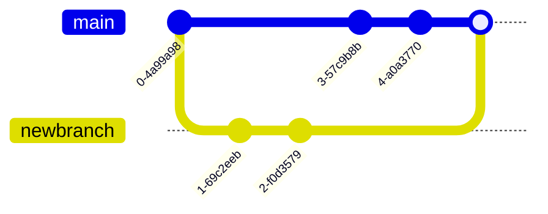

# README.MD

```mermaid
gitGraph:
commit
branch newbranch
checkout newbranch
commit
commit
checkout main
commit
commit
merge newbranch
```

```mermaid
gitGraph:
options
{
    "nodeSpacing": 150,
    "nodeRadius": 10
}
end
commit
branch newbranc
commit
checkout main
branch Paris
commit
branch Dublin
commit
branch main
checkout main
commit
branch Lyon
commit
branch Paris
commit
checkout Paris
commit
checkout Lyon
merge Paris
merge Dublin
merge newbranc
merge main
merge Lyon

```

```mermaid
gitGraph:
options
{
    "nodeSpacing": 150,
    "nodeRadius": 10
}
end
commit
commit
branch main
checkout main
commit
commit
commit
commit
branch Paris
checkout Paris
commit
commit
commit
commit
commit
branch main
checkout main
commit
merge Paris
merge main

```