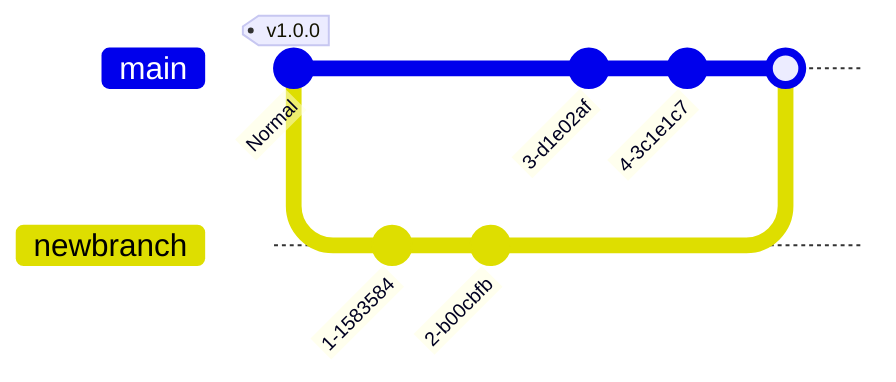
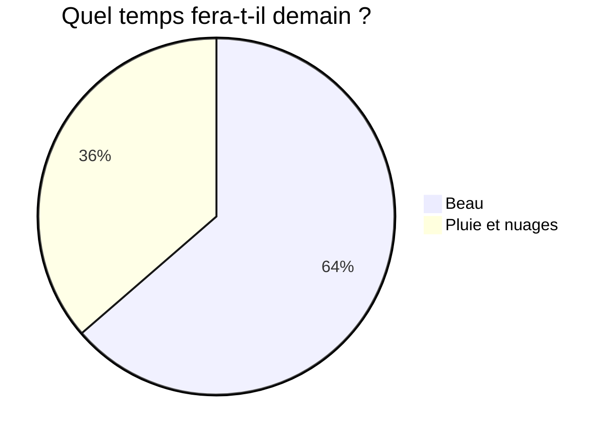
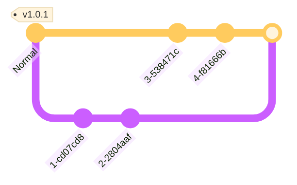

# README.MD

```mermaid
gitGraph
commit id: "Normal" tag: "v1.0.0"
branch newbranch
checkout newbranch
commit
commit
checkout main
commit
commit
merge newbranch
```

```mermaid
pie title Quel temps fera-t-il demain ?
         "Beau" : 70
         "Pluie et nuages" : 40
```

```mermaid
%%{init: { 'logLevel': 'debug', 'theme': 'base', 'gitGraph': {'showBranches': false}} }%%
gitGraph
commit id: "Normal" tag: "v1.0.1"
branch newbranch
checkout newbranch
commit
commit
checkout main
commit
commit
merge newbranch
```
